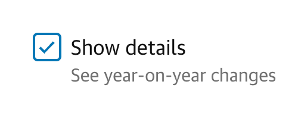
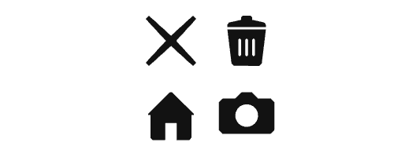
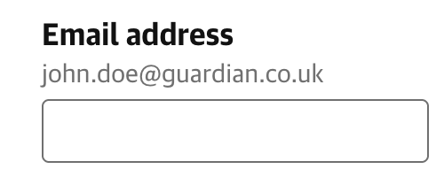
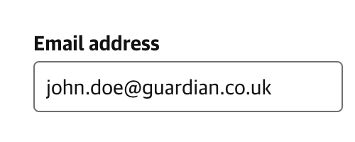

# Interactive Source components

An NPM package containing simplified CSS-only versions of the React components made available in the [@guardian/source](https://github.com/guardian/csnx/tree/main/libs/%40guardian/source) library.

These styles can be loaded into web projects of any kind (Svelte, React, plain old HTML), and will make your **buttons**, **input fields**, **icons**, **loading spinners** ([and more!](#components)) look like proper Guardian ones.

> [!NOTE]  
> This library is WIP and likely to see significant breaking changes.
> Reach out to ed.gargan@guardian.co.uk with any queries.

## Getting started

Install the package using NPM or your package manager of choice.

```bash
npm install git+git@github.com:guardian/interactive-source-components.git
```

The package exports CSS files for each component, eg.
`"@guardian/interactive-source-components/button.css"`, containing classes that make your HTML look
all Guardian.

These files can be imported using Javascript's `import`, or CSS's `@import`.

For example, using these styles in a Svelte component will look something like this.

```svelte
<script>
  import "@guardian/interactive-source-components/button.css"
  import "@guardian/interactive-source-components/icons.css"
</script>

<button class="src-button src-button--tertiary">
  <div class="src-icon--add-to-basket"></div>
  Click me
</button>
```

> [!WARNING]  
> These CSS files contain classes that cover many of the possible configuration options for each component, eg. `src-button--small`, `src-button--tertiary`.
>
> Ensure that your build system is set up to remove unused CSS classes, such as using the [@fullhuman/postcss-purgecss](https://www.npmjs.com/package/@fullhuman/postcss-purgecss) PostCSS plugin.

## Components

Below is a list of all of the components currently offered by this library (more coming soon!), with links to documentation for each.

<!-- prettier-ignore -->
| [Button](./src/button/README.md) | [Checkbox](./src/checkbox/README.md) | [Icons](./src/icons/README.md) |
| - | - | - |
|  |  |  |

<!-- prettier-ignore -->
| [Label](./src/label/README.md) | [Spinner](./src/spinner/README.md) | [Text Input](./src/text-input/README.md) |
| - | - | - |
|  |  |  |

### Coming soon 🏗️

- Accessibility foundations (focus rings, visually-hidden, etc)
- Select
- Radio buttons
- Success/error feedback for inputs
